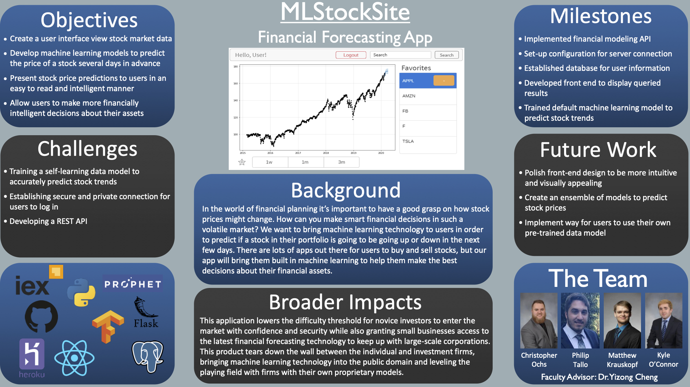

Senior Project: Financial Forecasting - ML Stock Site

Advisor: Yizong Cheng

Team Members: Matthew Krauskopf, Kyle O'Connor, Christopher Ochs, Philip Tallo

## Project Description

To allow users to have better control over their finances, we will provide a web-based multifaceted application. The application will use multiple machine learning models allowing for end users to examine specific publicly traded stocks. A prediction, with a specific degree of certainty,  will be given to the user on whether the stock value is forecasted to increase or decrease. This functionality will allow for users to manage their stock market investments comfortably

## User Interface Specification

[Test Plan Description](./Senior Design Test Plans.pdf)

|      | Normal / Abnormal / Boundary | Blackbox / Whitebox | Functional / Performance | Unit / Integration | Passed / Failed |
| ---- | ---------------------------- | ------------------- | ------------------------ | ------------------ | --------------- |
| DA1  | Normal                       | Blackbox            | Performance              | Integration        | Passed          |
| DA2  | Boundary                     | Blackbox            | Performance              | Unit               | Passed          |
| DA3  | Normal                       | Whitebox            | Functional               | Unit               | Passed          |
| DA4  | Normal                       | Blackbox            | Functional               | Unit               | Passed          |
| DA5  | Normal                       | Blackbox            | Functional               | Unit               | Passed          |
| DV1  | Normal                       | Whitebox            | Functional               | Integration        | Passed          |
| DV2  | Normal                       | Whitebox            | Functional               | Integration        | Passed          |
| DV3  | Normal                       | Blackbox            | Performance              | Integration        | Passed          |
| DV4  | Normal                       | Blackbox            | Performance              | Integration        | Passed          |
| MV1  | Normal                       | Blackbox            | Performance              | Unit               | Passed          |

## Test Plan and Results

## User Manual

[Link to user manual](./UserManual.md)

## Final Presentation

[youtube video](https://www.youtube.com/watch?v=_c-rMx-0ESM&list=PLrQTsQtz1gDhyIXxil3HSHzLsWgYWdqUH&index=3&t=0s)

## Expo Poster

## Initial Assessment

[Christopher Ochs](https://github.com/Christopher-Ochs/SeniorDesignProject/blob/master/Induvidual%20Capstone%20Assessment/OchsCapstoneAssessment.docx)

[Philip Tallo](https://github.com/Christopher-Ochs/SeniorDesignProject/blob/master/Induvidual%20Capstone%20Assessment/Philip%20Tallo%20-%20Individual%20Capstone%20Assessment.md)

[Matthew Krauskopf](https://github.com/Christopher-Ochs/SeniorDesignProject/blob/master/Induvidual%20Capstone%20Assessment/Capstone%20Assessment.docx)

[Kyle O'Connor](https://github.com/Christopher-Ochs/SeniorDesignProject/blob/master/Induvidual%20Capstone%20Assessment/Assignment3KyleOConnor.docx)

## Final Assessments

[<u>Christopher Ochs</u>](https://github.com/Christopher-Ochs/SeniorDesignProject/blob/master/FinalCapstoneAssesments/Ochs_FinalAssessment.docx)

[<u>Philip Tallo</u>](https://github.com/Christopher-Ochs/SeniorDesignProject/blob/master/FinalCapstoneAssesments/PhilipTallo_FinalSelfAssessment.pdf)

[<u>Matthew Krauskopf</u>](https://github.com/Christopher-Ochs/SeniorDesignProject/blob/master/FinalCapstoneAssesments/MattKrauskopf_SelfAssessment.docx)

[<u>Kyle O'Connor</u>](https://github.com/Christopher-Ochs/SeniorDesignProject/blob/master/FinalCapstoneAssesments/OConnorFinalAssessment.docx)

## Summary Of Hours - Fall Semester

| Reason                               | Philip | Christopher | Matthew | Kyle |
| ------------------------------------ | :----: | :---------: | :-----: | :--: |
| Professional Biography               |  1.25  |     1.5     |    1    | 0.75 |
| September 4th Meeting                |   1    |      1      |    1    |  1   |
| Project Description                  |  1.5   |    1.75     |   1.5   | 1.5  |
| September 11th Meeting               |   1    |      1      |    1    |  1   |
| Induvidual Capstone Assessment       |  1.25  |     1.5     |   1.5   | 1.75 |
| September 18th Meeting               |   1    |      1      |    1    |  1   |
| User Stories and Design Diagrams     |   4    |      4      |    4    |  4   |
| September 25th Meeting               |   1    |      1      |    1    |  1   |
| Finance API Research                 |   -    |      5      |   4.5   |  -   |
| October 2nd Meeting                  |   1    |      1      |    1    |  1   |
| ML Framework Research                |  3.75  |      -      |    -    | 4.25 |
| October 9th Meeting                  |   1    |      1      |    1    |  1   |
| Task List                            |  2.75  |    2.75     |  2.75   | 2.75 |
| Milestones, Timeline, Effort Matrix  |   2    |      3      |  2.25   |  2   |
| October 16th Meeting                 |   1    |      1      |    1    |  1   |
| Meeting 1 with Prof. Cheng           |   1    |      1      |    1    |  1   |
| ML Tech Demoing                      |   5    |      -      |    2    | 4.5  |
| October 23rd Meeting                 |   1    |      1      |    1    |  1   |
| Constraint Essay                     |  0.5   |      2      |    1    |  1   |
| October 30th Meeting                 |   1    |      1      |    1    |  1   |
| November 6th Meeting                 |   1    |      1      |    1    |  1   |
| Recorded Slideshow Presentation      |   4    |     4.5     |    5    |  4   |
| November 13th Meeting                |   1    |      1      |    1    |  1   |
| Financial Modeling Literature Survey |   4    |      4      |    4    |  4   |
| November 20th Meeting                |   1    |      1      |    1    |  1   |
| November 27th Meeting                |   1    |      1      |    1    |  1   |
| December 4th Meeting                 |   1    |      1      |    1    |  1   |
| Final Design Reports                 |   2    |      1      |    2    |  1   |

Note: Entries are in hours and are estimates of time worked

## Summary of Hours - Spring Semester

| Reason                  | Philip | Christopher | Matthew | Kyle |
| ----------------------- | ------ | ----------- | ------- | ---- |
| Assignment 1            | 1      | 1           | 1       | 1    |
| Assignment 2            | 1      | 1           | 1       | 1    |
| Assignment 3            | 2      | 2           | 2       | 2    |
| Hackathon               | 24     | 24          | 24      | 24   |
| Assignment 4            | 1      | 1           | 1       | 2    |
| Assignment 5            | 1      | 1           | 3       | 1    |
| Front End Coding        | 20     | 2           | 2       | 2    |
| Model Development       | 2      | -           | -       | 20   |
| Back End Development    | 10     | 20          | 10      | 2    |
| Database Development    | 20     | 10          | 15      | -    |
| Polish Code Before Expo | 15     | 15          | 15      | 15   |
| Final Expo Video        | 3      | 3           | 3       | 3    |
| Assignment 6            | 1      | 1           | 1       | 1    |
| Assignment 7            | 1      | 1           | 1       | 1    |

Note: Entries are in hours and are estimates of time worked